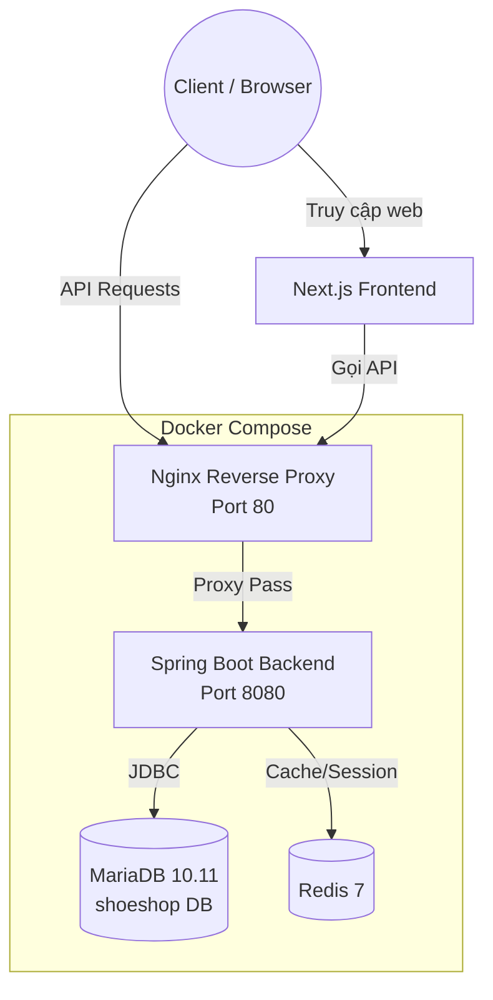

# ShoeShop E-commerce Platform

Chào mừng bạn đến với dự án **ShoeShop**, một nền tảng thương mại điện tử chuyên cung cấp giày dép với trải nghiệm người dùng cao cấp, hiện đại và mượt mà.

## 📸 1. Giao diện người dùng (Screenshot)

Giao diện cửa hàng được thiết kế theo phong cách hiện đại (Premium Design), tập trung vào việc làm nổi bật sản phẩm và mang lại trải nghiệm mua sắm trực quan, thân thiện nhất.


---

## 🏗️ 2. Sơ đồ kiến trúc hệ thống (Architecture Diagram)

Hệ thống được thiết kế theo mô hình client-server, tách biệt hoàn toàn giữa Frontend và Backend. Các dịch vụ Backend được đóng gói (containerized) thông qua Docker.



**Mô tả các thành phần chính:**
- **Frontend**: Ứng dụng Next.js cung cấp giao diện người dùng, gọi dữ liệu từ Backend qua các API.
- **Nginx Reverse Proxy**: Chịu trách nhiệm nhận luồng traffic từ bên ngoài và chuyển tiếp (proxy pass) các request tới Backend an toàn, bảo mật.
- **Backend**: Ứng dụng Spring Boot cung cấp RESTful API, xử lý business logic, xác thực JWT, v.v.
- **MariaDB**: Hệ quản trị cơ sở dữ liệu lưu trữ thông tin sản phẩm, đơn hàng, người dùng.
- **Redis**: Caching dữ liệu tĩnh và tăng tốc độ truy xuất, xử lý hiệu năng cho các dịch vụ đòi hỏi tốc độ cao.

---

## 🚀 3. Hướng dẫn cài đặt và khởi chạy với Docker Compose

Dự án sử dụng `docker-compose` để dễ dàng triển khai và quản lý các dịch vụ Backend (MariaDB, Redis, Spring Boot, Nginx) chỉ với vài thao tác.

### Yêu cầu cài đặt (Prerequisites)
- Đã cài đặt [Docker](https://docs.docker.com/get-docker/) và [Docker Compose](https://docs.docker.com/compose/install/).

### Các bước khởi chạy (Step-by-step)

**Bước 1: Mở Terminal (Command Prompt / PowerShell)**
Mở terminal và trỏ đường dẫn tới thư mục chứa mã nguồn của Backend:
```bash
cd ShoeShopBackEnd
```

**Bước 2: Cấu hình biến môi trường**
Kiểm tra xem đã có file `.env` chưa. File `docker-compose.yml` sẽ đọc cấu hình từ `.env`. Nếu chưa có, bạn tạo một file tên là `.env` (ngang hàng với `docker-compose.yml`) và thêm các biến cần thiết, ví dụ:
```env
DB_USERNAME=root
DB_PASSWORD=your_secure_password
```

**Bước 3: Build và khởi động các container**
Chạy lệnh sau để Docker tải images, build backend và khởi động tất cả các service (chế độ chạy ngầm):
```bash
docker-compose up -d --build
```
*Lưu ý: Quá trình này có thể mất vài phút cho lần chạy đầu tiên do Docker cần tải các images (MariaDB, Redis, Nginx) và tải các dependencies Maven cho Spring Boot.*

**Bước 4: Kiểm tra trạng thái các container**
Sau khi lệnh chạy xong, kiểm tra xem tất cả các container đã ở trạng thái `Up` (đang chạy) chưa:
```bash
docker-compose ps
```

**Bước 5: Truy cập hệ thống**
- **Backend API**: Truy cập qua Nginx (Port 80) hoặc trực tiếp Port 8080. Bạn có thể test bằng cách gọi thử: `http://localhost:8080/`
- **Database (MariaDB)**: Sẽ tự động import dữ liệu mẫu từ `data_import.sql` trong lần khởi chạy đầu tiên.

### Dừng các dịch vụ (Stop containers)
Khi không sử dụng nữa, bạn có thể dừng hệ thống bằng lệnh:
```bash
docker-compose down
```
*(Nếu muốn xóa sạch dữ liệu volume đã lưu ở database thì thêm flag `-v`: `docker-compose down -v`)*

---
*Cảm ơn bạn đã quan tâm đến dự án ShoeShop!*
